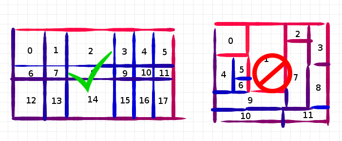

Getting started
===============

Quickstart
----------

pyDive is built on top of *IPython.parallel*, *numpy* and *mpi4py*. *h5py*, *adios* and *pycuda* are optional. Running ``python setup.py install`` will install
pyDive with these and other required packages from `requirements.txt`. Alternatively you can install it via pip: ``pip install pyDive``.

Basic code example: ::

  import pyDive
  pyDive.init(profile='mpi')

  arrayA = pyDive.ones((1000, 1000, 1000), distaxes='all')
  arrayB = pyDive.zeros_like(arrayA)

  # do some array operations, + - * / sin cos, ..., slicing, etc...
  arrayC = arrayA + arrayB

  # plot result
  import matplotlib.pyplot as plt
  plt.imshow(arrayC[500,::10,::10])

Before actually running this script there must have been an IPython.parallel cluster launched (see section below) otherwise `pyDive.init()` fails.

pyDive distributes array-memory along one or multiple user-specified axes:

You can either specify the exact decomposition for each axis or leave the default which persuits to squared chunks.

Although the array elements are stored on the cluster nodes you have full access through indexing. If you want to have a local array
from a pyDive-array anyway you can call ``array.gather()`` but make sure that your pyDive-array is small enough to fit
into your local machine's memory. If not you may want to slice it first. Note that an array is also gathered implicitly
if you try to access an attribute which is only available for the local array. This is why there is no ``gather()`` in the example above
when calling ``imshow()``.

.. _cluster-config:

Setup an IPython.parallel cluster configuration
-----------------------------------------------

The first step is to create an IPython.parallel profile: http://ipython.org/ipython-doc/2/parallel/parallel_process.html.
The name of this profile is the argument of :func:`pyDive.init`. It defaults to ``"mpi"``.
Starting the cluster is then the second and final step::

  $ ipcluster start -n 4 --profile=mpi

Run tests
---------

In order to test the pyDive installation run::

  $ python setup.py test

This will ask you for the IPython.parallel profile to be used and the number of engines to be started, e.g.: ::

  $ Name of your IPython-parallel profile you want to run the tests with: pbs
  $ Number of engines: 256

Then the script starts the cluster, runs the tests and finally stops the cluster. If you have already a cluster running by your own
you can also run the tests by launching ``py.test`` from the pyDive directory and setting the environment variable ``IPP_PROFILE_NAME``
to the profile's name.

Overview
--------

pyDive knows different kinds of distributed arrays, all corresponding to a local, non-distributed array:
  - numpy -> :obj:`pyDive.ndarray` -> Stores array elements in cluster nodes' memory.
  - hdf5 -> :obj:`pyDive.h5.h5_ndarray` -> Stores array elements in a hdf5-file.
  - adios -> :obj:`pyDive.ad.ad_ndarray` -> Stores array elements in a adios-file.
  - gpu -> :obj:`pyDive.gpu.gpu_ndarray` -> Stores array elements in clusters' gpus.
  - :obj:`pyDive.cloned_ndarray` -> Holds independent copies of one array on cluster nodes.

Among these three packages there are a few modules:
  - :mod:`pyDive.structered` -> structured datatypes
  - :mod:`pyDive.algorithm` -> map, reduce, mapReduce
  - :mod:`pyDive.fragment` -> fragment file-disk array to fit into the cluster's main memory
  - :mod:`pyDive.mappings` -> particle-mesh mappings
  - :mod:`pyDive.picongpu` -> helper functions for picongpu-users
  - :mod:`pyDive.pyDive` -> shortcuts for most used functions

