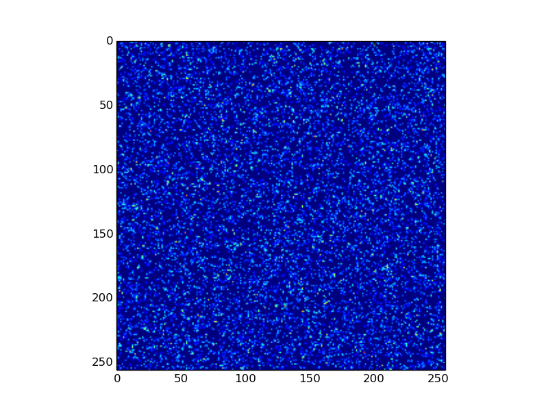
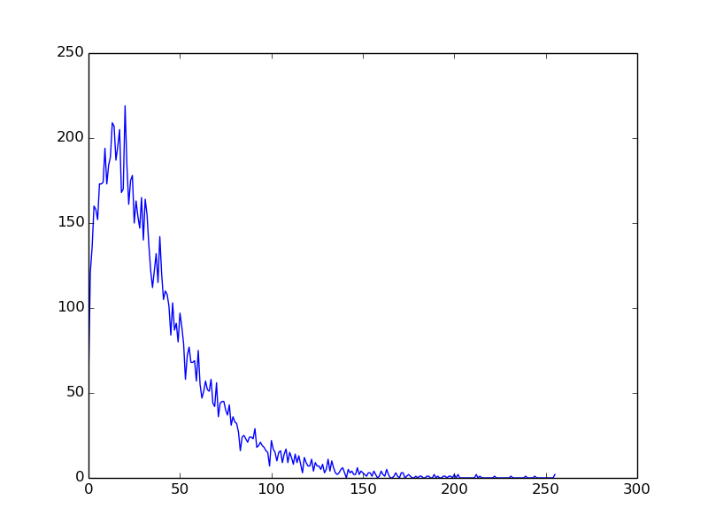

Tutorials
=========

In this section we are going through a few use cases for pyDive. If you want to test the code you can download 
the :download:`sample hdf5-file<sample.h5>`. 
It has the following dataset structure::

    $ h5ls -r sample.h5
    /                        Group
    /fields                  Group
    /fields/fieldB           Group
    /fields/fieldB/z         Dataset {256, 256}
    /fields/fieldE           Group
    /fields/fieldE/x         Dataset {256, 256}
    /fields/fieldE/y         Dataset {256, 256}
    /particles               Group
    /particles/cellidx       Group
    /particles/cellidx/x     Dataset {10000}
    /particles/cellidx/y     Dataset {10000}
    /particles/pos           Group
    /particles/pos/x         Dataset {10000}
    /particles/pos/y         Dataset {10000}
    /particles/vel           Group
    /particles/vel/x         Dataset {10000}
    /particles/vel/y         Dataset {10000}
    /particles/vel/z         Dataset {10000}

After launching the cluster (:ref:`cluster-config`) the first step is to initialize pyDive: ::

    import pyDive
    pyDive.init()

Load a single dataset: ::

    h5fieldB_z = pyDive.h5.fromPath("sample.h5", "/fields/fieldB/z", distaxis=0)

    assert type(h5fieldB_z) is pyDive.h5_ndarray.h5_ndarray.h5_ndarray

*h5fieldB_z* just holds a dataset *handle*. To read out data into memory do slicing: ::

    fieldB_z = h5fieldB_z[:]

    assert type(fieldB_z) is pyDive.ndarray.ndarray.ndarray

This loads the entire dataset into the main memory of all :term:`engines<engine>`. The array elements are distributed
along ``distaxis=0``.

We can also load a hdf5-group: ::

    h5fieldE = pyDive.h5.fromPath("sample.h5", "/fields/fieldE", distaxis=0)
    fieldE = h5fieldE[:] 

*h5fieldE* and *fieldE* are some so called "virtual array-of-structures", see: :mod:`pyDive.arrayOfStructs`. ::

    >>> print h5fieldE
    VirtualArrayOfStructs<array-type: <class 'pyDive.h5_ndarray.h5_ndarray.h5_ndarray'>, shape: [256, 256]>:
      y -> float32
      x -> float32

    >>> print fieldE
    VirtualArrayOfStructs<array-type: <class 'pyDive.ndarray.ndarray.ndarray'>, shape: [256, 256]>:
      y -> float32
      x -> float32

Now, let's do some calculations!

Example 1: Total field energy
-----------------------------

Computing the total field energy of an electromagnetic field means squaring and summing or in pyDive's words: ::

    import pyDive
    import numpy as np
    pyDive.init()

    h5input = "sample.h5"

    h5fields = pyDive.h5.fromPath(h5input, "/fields", distaxis=0)
    fields = h5fields[:] # read out all fields into cluster's main memory in parallel
    
    energy_field = fields["fieldE/x"]**2 + fields["fieldE/y"]**2 + fields["fieldB/z"]**2

    total_energy = pyDive.reduce(energy_field, np.add)
    print total_energy

Output: ::

    $ python example1.py
    557502.0

Well this was just a very small hdf5-sample of 1.3 MB however in real world we deal with a lot greater data volumes.
So what happens if *h5fields* is too large to be stored in the main memory of the whole cluster? The line ``fields = h5fields[:]`` will crash.
In this case we want to load the hdf5 data piece by piece. The functions in :mod:`pyDive.algorithm` help us doing so: ::

    import pyDive
    import numpy as np
    pyDive.init()

    h5input = "sample.h5"

    h5fields = pyDive.h5.fromPath(h5input, "/fields", distaxis=0)

    def square_fields(npfields):
        return npfields["fieldE/x"]**2 + npfields["fieldE/y"]**2 + npfields["fieldB/z"]**2

    total_energy = pyDive.mapReduce(square_fields, np.add, h5fields)
    print total_energy

*square_fields* is called on each :term:`engine` where *npfield* is a structure (:mod:`pyDive.arrayOfStructs`) of numpy-arrays representing a sub part of the big *h5fields*.
:func:`pyDive.algorithm.mapReduce` can be called with an arbitrary number of arrays including
:obj:`pyDive.ndarrays`, :obj:`pyDive.h5_ndarrays` and :obj:`pyDive.cloned_ndarrays`. If there are :obj:`pyDive.h5_ndarrays` it will
check whether they fit into the combined main memory of all cluster nodes as a whole and loads them piece by piece if not.

Now let's say our dataset is really big and we just want to get a first estimate of the total energy: ::

  ...
  total_energy = pyDive.mapReduce(square_fields, np.add, h5fields[::10, ::10]) * 10.0**2

This is valid if *h5fields[::10, ::10]* fits into the cluster's main memory. Remember that slicing on a :obj:`pyDive.h5_ndarray` always
means data transfer between hdf5 and main memory. So in this case we also could have used the very first version: ::

    import pyDive
    import numpy as np
    pyDive.init()

    h5input = "sample.h5"

    h5fields = pyDive.h5.fromPath(h5input, "/fields", distaxis=0)
    fields = h5fields[::10, ::10]
    
    energy_field = fields["fieldE/x"]**2 + fields["fieldE/y"]**2 + fields["fieldB/z"]**2

    total_energy = pyDive.reduce(energy_field, np.add) * 10.0**2
    print total_energy

But if *h5fields[::10, ::10]* doesn't fit we have to apply the slicing somewhere else in fact
at the instanciation of *h5fields*: ::

    import pyDive
    import numpy as np
    pyDive.init()

    h5input = "sample.h5"

    h5fields = pyDive.h5.fromPath(h5input, "/fields", distaxis=0, window=np.s_[::10, ::10])

    def square_fields(npfields):
        return npfields["fieldE/x"]**2 + npfields["fieldE/y"]**2 + npfields["fieldB/z"]**2

    total_energy = pyDive.mapReduce(square_fields, np.add, h5fields) * 10.0**2
    print total_energy

This way the hdf5 data is sliced without involving file i/o.

If you use `picongpu <https://github.com/ComputationalRadiationPhysics/picongpu>`_
here is an example of how to get the total field energy for each timestep (see :mod:`pyDive.picongpu`): ::

    import pyDive
    import numpy as np
    pyDive.init()

    def square_field(npfield):
        return npfield["x"]**2 + npfield["y"]**2 + npfield["z"]**2

    for step, h5field in pyDive.picongpu.loadAllSteps("/.../simOutput", "fields/FieldE", distaxis=0):
        total_energy = pyDive.mapReduce(square_field, np.add, h5field)

        print step, total_energy

Example 2: Particle density field
---------------------------------

Given the list of particles in our ``sample.h5`` we want to create a 2D density field out of it. For this particle-to-mesh
mapping we need to apply a certain particle shape like cloud-in-cell (CIC), triangular-shaped-cloud (TSC), and so on. A list of 
these together with the actual mapping functions can be found in the :mod:`pyDive.mappings` module. If you miss a shape you can
easily create one by your own by basically defining a particle shape function. Note that if you have `numba <http://numba.pydata.org/>`_
installed the shape function will be compiled resulting in a significant speed-up.

We assume that the particle positions are distributed randomly. This means although each engine is loading a separate part of all particles it needs to 
write to the entire density field. Therefore the density field must have a whole representation on each participating engine.
This is the job of :class:`pyDive.cloned_ndarray.cloned_ndarray.cloned_ndarray`. ::

    import pyDive
    import numpy as np
    pyDive.init()

    shape = [256, 256]
    density = pyDive.cloned.zeros(shape)

    h5input = "sample.h5"

    particles = pyDive.h5.fromPath(h5input, "/particles", distaxis=0)

    def particles2density(particles, density):
        total_pos = particles["cellidx"].astype(np.float32) + particles["pos"]

        # convert total_pos to an (N, 2) shaped array
        total_pos = np.hstack((total_pos["x"][:,np.newaxis],
                               total_pos["y"][:,np.newaxis]))

        par_weighting = np.ones(particles.shape)
        import pyDive.mappings
        pyDive.mappings.particles2mesh(density, par_weighting, total_pos, pyDive.mappings.CIC)

    pyDive.map(particles2density, particles, density)

    final_density = density.sum() # add up all local copies

    from matplotlib import pyplot as plt
    plt.imshow(final_density)
    plt.show()

Output:

Here, as in the first example, *particles2density* is a function executed on the :term:`engines <engine>` by :func:`pyDive.algorithm.map`.
All of its arguments are numpy-arrays or structures (:mod:`pyDive.arrayOfStructs`) of numpy-arrays.

:func:`pyDive.algorithm.map` can also be used as a decorator: ::

    @pyDive.map
    def particles2density(particles, density):
        ...

    particles2density(particles, density)

Example 3: Particle energy spectrum
-----------------------------------

::

    import pyDive
    import numpy as np
    pyDive.init()

    bins = 256
    spectrum = pyDive.cloned.zeros([bins])

    h5input = "sample.h5"

    velocities = pyDive.h5.fromPath(h5input, "/particles/vel", distaxis=0)

    @pyDive.map
    def vel2spectrum(velocities, spectrum, bins):
        mass = 1.0
        energies = 0.5 * mass * (velocities["x"]**2 + velocities["y"]**2 + velocities["z"]**2)

        spectrum[:], bin_edges = np.histogram(energies, bins)

    vel2spectrum(velocities, spectrum, bins=bins)

    final_spectrum = spectrum.sum() # add up all local copies

    from matplotlib import pyplot as plt
    plt.plot(final_spectrum)
    plt.show()

Output:

